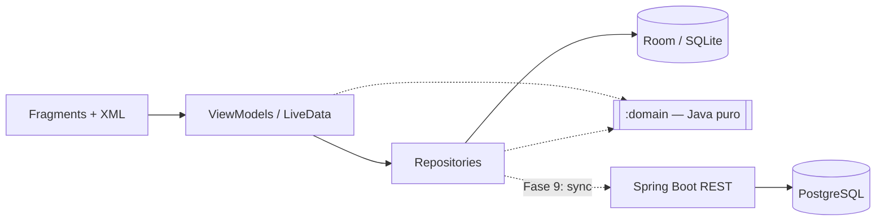

# FlowGym

[](https://github.com/thiagojosetj/flowgym/actions/workflows/ci.yml)

> **Nome provisório.** Aplicativo de acompanhamento de musculação **offline-first**, feito em **Java**
> para Android, com backend Spring Boot e app iOS planejados.

Projeto pessoal e de portfólio. O objetivo é registrar treinos com poucos toques, comparar cada
sessão com as anteriores e mostrar a evolução de forma honesta, sem métricas infladas. O HEVY serviu
apenas como referência conceitual: nenhum código, texto, imagem ou identidade visual foi copiado.

---

## Status

🟡 **Em desenvolvimento — já dá para treinar com ele.**

O ciclo completo funciona: montar um treino, iniciá-lo, registrar cada série, descansar com
cronômetro, finalizar, ver o resumo e reabrir qualquer sessão passada pelo histórico. Tudo local,
sem conta e sem internet. Falta validar em aparelho a notificação e o serviço em primeiro plano.
Veja o [roadmap](docs/ROADMAP.md).

## Screenshots

_Em breve._ (Ainda não há aparelho/emulador neste ambiente de desenvolvimento; as telas são
verificadas por testes de UI automatizados.)

## Funcionalidades

### Implementadas
- **Biblioteca de exercícios** com 55 exercícios de catálogo próprio, em 13 grupos e 38 subgrupos
  musculares (costas subdividida em latíssimo, trapézio superior, trapézio médio/inferior, romboides…).
- **Busca** que ignora maiúsculas e acentos, encontra trechos do nome e reconhece apelidos de academia
  ("puxador", "stiff", "serrote").
- **Filtros combináveis**: grupo + subgrupo + equipamento + papel do músculo (principal/secundário).
- **Detalhe do exercício**: músculo principal em destaque, secundários, equipamentos, passo a passo,
  dicas, erros comuns e "como registrar" (halteres por unidade, peso corporal ± carga, unilateral).
- **Treinos (templates)**: criar, editar, duplicar e excluir (exclusão lógica); padrão de
  **3 séries × 12 repetições** ao adicionar; faixas de repetições (8–10), carga, descanso, observações
  permanentes; **reordenação por arrastar e soltar** (e por menu, acessível ao TalkBack).
- **Cargas honestas**: halteres sempre "por halter" (nunca somados na tela); exercícios de peso
  corporal aceitam carga adicional (+) ou assistência (−).
- **Treino em andamento**: uma tela com todos os exercícios, uma linha por série com **planejado /
  anterior / atual**, marcar série feita, adicionar e remover séries, técnica por série com ⓘ.
- **Nada se perde**: cada série confirmada vai para o banco na hora; o treino sobrevive a girar a tela,
  ao app ir para o fundo e ao processo ser morto — ao voltar, a faixa "você tem um treino em andamento"
  continua de onde parou.
- **Tempo por timestamps**: o cronômetro geral e o descanso são sempre calculados de instantes
  gravados, nunca de um contador — então ficam certos depois de uma hora com a tela apagada. Pausa,
  retomada e ajustes de descanso (−15 / +15 / +30 s).
- **Notificação persistente** com cronômetro nativo e ações Pausar/Abrir, em foreground service
  `health`; som e vibração de fim de descanso conforme as configurações.
- **Finalização honesta**: antes de finalizar, o app diz exatamente o que fará com cada série não
  confirmada; nada é descartado em silêncio, e o resumo informa quantas séries **não** entraram no
  volume (peso corporal e exercícios por tempo ficam fora de propósito).
- **Histórico**: sessões concluídas, mais recentes primeiro, com **calendário do mês** marcando os
  dias treinados — tocar num dia deixa só as sessões dele. O dia é o que foi vivido (o fuso viaja
  com a sessão), não o que o relógio diz agora. Cada sessão abre em detalhe montado **só dos
  snapshots** dela: editar o treino depois não muda o passado. Comparação com a sessão anterior do
  mesmo treino (volume, séries, repetições, tempo efetivo), avaliação opcional de 1 a 5 e exclusão
  de uma sessão registrada por engano.
- **Configurações da conta**: descanso padrão (90 s de fábrica, editável), som e vibração.
- **Tema** claro, escuro ou seguindo o sistema; paleta própria (Material 3).
- **Multiusuário desde o banco**: identidade local agora, pronta para contas e sincronização depois.

### Planejadas
Recordes pessoais, gráficos, rotinas semanais e **cíclicas**,
metas e sequências de aderência, conquistas, contas + sincronização entre aparelhos, compartilhamento
de treinos e dados corporais (peso e bioimpedância). Detalhes em
[docs/PRODUCT_SPEC.md](docs/PRODUCT_SPEC.md).

## Arquitetura



- **Offline-first**: o banco local é a fonte de verdade. A rede (futura) só sincroniza.
- **Módulo `:domain` em Java puro**: regras de negócio (padrões 3×12, validações, cargas em gramas,
  UUID v7, busca normalizada) testadas na JVM, sem Android, portáveis para o iOS.
- **MVVM + Repository**, single-activity com Navigation Component, **injeção de dependência manual**
  (um `AppContainer` explícito, sem singletons improvisados).
- **Sincronização desenhada antes de implementada**: agregados versionados pelo servidor, cópias de
  conflito para templates e eventos append-only — nada de "última alteração vence" cego.

Documentos: [Arquitetura](docs/ARCHITECTURE.md) · [Banco de dados](docs/DATABASE.md) ·
[Sincronização](docs/SYNC.md) · [Decisões (ADRs)](docs/DECISIONS.md) · [Roadmap](docs/ROADMAP.md) ·
[Instalar no aparelho](docs/DEVICE_SETUP.md) · [Testar no aparelho](docs/DEVICE_TESTING.md).

## Tecnologias

| Camada | Escolha |
|---|---|
| Linguagem | Java 17 (código do app 100% Java; sem Compose) |
| Android | compileSdk/targetSdk 37 (Android 17), minSdk 28 |
| UI | Views + XML, Material Components 1.14 (Material 3), ViewBinding |
| Arquitetura | AndroidX ViewModel + LiveData, Navigation 2.10, Fragment Result API |
| Dados | Room 2.8.5 (SQLite), schema exportado e versionado |
| Build | Gradle 9.7.1 (wrapper com checksum), AGP 9.4.1, version catalog |
| Testes | JUnit 4, Robolectric 4.17, Espresso, Room em memória |
| Backend (planejado) | Java 21, Spring Boot 4, PostgreSQL, Flyway, OpenAPI |

## Como executar

**Pré-requisitos:** JDK 21 e Android SDK com a plataforma 37 (o Android Studio instala ambos).

```bash
git clone <url-do-repositório>
cd FlowGym/android-app
```

- **Android Studio:** abra a pasta `android-app`. O `local.properties` com o caminho do SDK é criado
  automaticamente (ele nunca é versionado).
- **Linha de comando:** crie `android-app/local.properties` com `sdk.dir=<caminho do seu Android SDK>` e rode:

```bash
./gradlew assembleDebug
```

O APK de debug fica em `app/build/outputs/apk/debug/` e pode ser instalado ao lado de uma versão de
release (o id de debug termina em `.debug`).

## Testes

```bash
./gradlew :domain:test :app:testDebugUnitTest :app:lintDebug
```

São **397 testes** (154 no `:domain`, 243 no `:app`), todos na JVM — nenhum emulador necessário.

- **`:domain`** — regras puras: padrões de treino, validações, cargas, UUID v7, normalização de busca,
  aritmética de tempo do treino (pausas, relógio andando para trás, descanso), volume (com as exclusões
  que a especificação exige) e a validação da finalização.
- **`:app`** (Robolectric) — seed do catálogo, busca e filtros no SQLite real, ida e volta do agregado
  de treino, migrations v1 → v4, ViewModels, o **fluxo completo pela interface** (biblioteca →
  selecionar exercício → criar treino → editar séries → salvar → reabrir), o **treino em andamento**
  (iniciar → registrar série → descanso → pausar → finalizar) e o **histórico** (calendário, filtro
  por dia, detalhe, avaliação e exclusão), incluindo um teste que fecha o banco em arquivo e reabre
  para provar que um treino sobrevive à morte do processo.
- **Lint** do Android com `checkDependencies`, o que inclui o módulo `:domain` contra a API 28.
  O único achado é o `AndroidGradlePluginVersion` (pergunta a uma lista remota se existe algo mais
  novo, então muda sozinho sem ninguém commitar nada); o CI o trata como aviso e barra qualquer outro.

Com um aparelho conectado (depuração USB ligada) ou um emulador:

```bash
./gradlew :app:connectedDebugAndroidTest
```

- **Smoke test** do fluxo principal no SQLite real, com teclado e widgets reais: criar treino →
  adicionar exercício → ajustar o descanso → salvar → excluir (limpa o que criou).
- **Migrations** com o `MigrationTestHelper` do Room (v1 → v4), que valida tabelas, colunas, índices e
  chaves estrangeiras contra o schema exportado.
- **Treino em andamento no aparelho**: o serviço em primeiro plano realmente promovido com o tipo
  `health`, a notificação com cronômetro, e o treino sobrevivendo a sair do app.

## Estrutura

```
android-app/   App Android (módulos :app e :domain)
backend/       Backend Spring Boot (Fase 8 — por enquanto, só o plano)
api/           Contrato OpenAPI compartilhado por Android e iOS (Fase 8)
docs/          Produto, arquitetura, banco, sincronização, roadmap, decisões e teste em aparelho
```

## Roadmap

Fundação → Biblioteca → Templates → **Treino ativo** → Histórico → Progresso → Rotinas → Conquistas →
Backend → Sync → Compartilhamento → Dados corporais. Status detalhado em [docs/ROADMAP.md](docs/ROADMAP.md).

## Créditos e licença

- Textos dos exercícios: conteúdo próprio.
- Ícones: [Material Design Icons](https://github.com/google/material-design-icons) (Google, Apache 2.0).
- Licença do projeto: **a definir**. Até lá, todos os direitos reservados.
