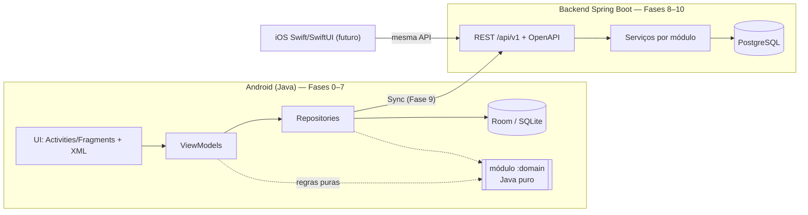

# Arquitetura

Este documento descreve **como** o sistema é organizado e **por quê**. Decisões pontuais e
controversas ficam registradas em [DECISIONS.md](DECISIONS.md) (ADRs). O modelo de dados está em
[DATABASE.md](DATABASE.md) e a sincronização em [SYNC.md](SYNC.md).

## 1. Visão do sistema



- **Hoje:** só o app Android existe, 100% local, com uma identidade local de usuário.
- **Depois:** o backend vira o ponto de encontro entre dispositivos; o banco local continua sendo a
  fonte de verdade durante o uso (offline-first).

## 2. Estrutura do repositório (monorepo)

```
/android-app   Projeto Gradle do Android (módulos :app e :domain)
/backend       Spring Boot (Fase 8) — hoje contém apenas o plano
/api           Contrato OpenAPI compartilhado por Android e iOS (Fase 8)
/docs          Produto, arquitetura, banco, sync, roadmap e decisões
README.md
```

Por que monorepo: o projeto é desenvolvido por uma pessoa, a documentação e o contrato de API
evoluem junto com os clientes, e a revisão por diff (inclusive pelo Codex) fica em um único lugar.
Cada pasta tem seu **build independente** (o Android não depende do backend para compilar). Ver
ADR-0001.

## 3. Plataforma Android: versões

| Item | Valor | Motivo |
|---|---|---|
| `compileSdk` | 37 (Android 17) | Mais recente estável (16/06/2026). Compilar contra a última API não muda comportamento em runtime. |
| `targetSdk` | 37 | A Google Play exige ≥ 36 desde 31/08/2026. Mirar 37 já agora evita migrar de novo em 2027 e nos obriga a tratar desde o início as mudanças do Android 17 (tela grande sempre redimensionável, áudio em segundo plano exige foreground service). |
| `minSdk` | 28 (Android 9) | Veja abaixo. |
| Java (linguagem) | 17 | Nível totalmente suportado pelo D8/R8 no Android (records, switch expressions, text blocks). O Gradle roda no JDK 21. |
| AGP / Gradle | 9.4.1 / 9.7.1 | Versões estáveis mais recentes; AGP 9.4 suporta até a API 37. |

**Por que `minSdk 28`:**
1. Cobertura ≈ 95% dos dispositivos ativos (dados públicos de distribuição de nov/2025); Android 8.x
   representa ≈ 2%.
2. `java.time` nativo (desde a API 26), sem *core library desugaring* — essencial para timestamps,
   datas locais do calendário e rotinas.
3. `ImageDecoder`/`AnimatedImageDrawable` (API 28): decodificam **WebP animado** nativamente, sem
   biblioteca extra — é o formato escolhido para as animações curtas dos exercícios (§9).
4. O Room 2.8 exige no mínimo a API 23; outras AndroidX recentes seguem o mesmo caminho, então ir
   abaixo de 28 traria pouco ganho e mais ramos de compatibilidade.

## 4. Módulos Android

```
android-app/
├── domain/   (java-library)  Regras de negócio puras: modelos, cálculos, validações. Sem Android.
└── app/      (android app)   UI, ViewModels, Room, repositórios, serviços, workers, DI manual.
```

- `:domain` **não pode** importar `android.*` — o compilador garante isso, porque o módulo é uma
  biblioteca Java pura. Assim, as regras críticas (volume, PR, cronômetros, rotina cíclica,
  conquistas, validação de templates) são testadas na JVM em milissegundos e ficam documentadas
  de forma independente da plataforma — o que facilita reimplementá-las no iOS e reaproveitar
  conceitos no backend.
- `:app` depende de `:domain`. Nunca o contrário.

## 5. Camadas e pacotes do `:app`

```
io.github.thiagojosetj.gym
├── GymApplication             Application: cria o AppContainer (raiz de composição)
├── AppContainer               Monta banco, executores e repositórios (DI manual)
├── core/                      Infra transversal pequena: AppExecutors, Event, utilidades
├── data/
│   ├── local/                 Room: AppDatabase, dao/, entity/, relation/, Converters
│   ├── seed/                  Carga do catálogo inicial (JSON em assets)
│   ├── repository/            Repositórios: API para os ViewModels, mapeiam entity ⇄ domain
│   └── remote/                (Fase 8+) Retrofit/OkHttp
├── ui/                        Uma pasta por funcionalidade: home/, library/, templates/, settings/, common/
├── service/                   (Fase 3) Foreground service do treino ativo
└── worker/                    (Fase 6/9) WorkManager: lembretes de rotina, sync
```

Organização **por funcionalidade dentro da UI** (tudo de "biblioteca" junto) e **por camada nos
dados**. Motivo: telas mudam juntas com seus ViewModels/adapters; a camada de dados é
compartilhada entre várias telas.

### 5.1 Fluxo de dados

```
Fragment ──observa──▶ LiveData ◀── ViewModel ──chama──▶ Repository ──▶ DAO ──▶ SQLite
   │                                  │                      │
   └── eventos do usuário ──────────▶ │                      └─ usa :domain para mapear/validar
                                      └─ usa :domain (ex.: TemplateDraft aplica defaults 3×12)
```

Regras:
- **Fragments** só desenham estado e repassam eventos. Nada de SQL, nada de regra de negócio.
- **ViewModels** guardam o estado da tela, sobrevivem à rotação e chamam repositórios.
- **Repositories** são a única porta de entrada para os dados. As telas nunca acessam DAOs.
- **DAOs** só existem dentro de `data/local`.

### 5.2 Threads
- Leituras observáveis: DAOs retornam `LiveData`, e o Room executa a consulta fora da main thread
  e reemite quando as tabelas mudam.
- Escritas: `AppExecutors.diskIO()` (executor **single-thread**) — serializa as escritas, evitando
  corridas (ex.: dois toques rápidos em "salvar").
- Resultados de escritas voltam à UI por `LiveData`/callback na main thread.
- `allowMainThreadQueries` **nunca** é usado em produção.

### 5.3 Estado de UI e eventos
- Estado contínuo (lista, filtros, formulário): `LiveData<Estado>`.
- Eventos únicos (navegar após salvar, mostrar snackbar): `LiveData<Event<T>>` — o `Event` é
  consumido uma vez, evitando repetir a navegação após rotação.

### 5.4 Navegação
Single-activity (`MainActivity`) + Navigation Component com grafo em XML e `BottomNavigationView`.
Argumentos por `Bundle` com métodos de fábrica estáticos nos fragments (sem o plugin Safe Args — ver
ADR-0018). Resultados entre telas (ex.: exercícios selecionados na biblioteca) usam a Fragment
Result API.

## 6. Guia de aprendizado — por que cada peça existe

**Room é usado porque…** é a camada oficial sobre SQLite: valida o SQL **em tempo de compilação**,
gera o código de mapeamento, observa mudanças (LiveData) e tem suporte de primeira classe a
migrations testáveis. Escrever `SQLiteOpenHelper` manual daria mais código e menos segurança.

**ViewModel existe para…** guardar o estado da tela fora do ciclo de vida do Fragment. Quando o
usuário gira o celular, o Fragment é destruído e recriado; o ViewModel não. Ele também é o lugar
certo para orquestrar chamadas ao repositório sem vazar `Context`.

**LiveData é usado porque…** é *lifecycle-aware*: só entrega dados quando a tela está visível e se
desinscreve sozinho ao destruir a view, evitando vazamentos e crashes. Em Java, é mais simples que
RxJava e não exige coroutines (Kotlin). Ver ADR-0006.

**Repository separa…** "de onde vêm os dados" de "o que a tela precisa". Hoje só há Room; na Fase 9
entra a API remota. As telas não mudam, porque continuam falando só com o repositório.

**O módulo `:domain` existe para…** manter as regras que importam (volume, PR, tempo, rotinas) em
Java puro, testável em milissegundos, sem emulador, e impossível de acoplar à UI por acidente.

**DI manual (AppContainer) em vez de Hilt porque…** com poucas dependências, um container explícito
ensina o que injeção de dependência realmente é (quem cria o quê, e quando) sem anotações
"mágicas". Se o grafo crescer muito, migrar para Hilt é mecânico. Ver ADR-0005.

**O executor single-thread para escritas existe porque…** o Room proíbe escrita na main thread (a UI
travaria). Um único thread de escrita garante ordem e evita condições de corrida.

**Foreground service (Fase 3) será necessário porque…** durante um treino, o app precisa (a) manter
uma notificação contínua com cronômetro e ações, (b) tocar o alerta de fim de descanso mesmo com a
tela apagada — e, no Android 17, áudio em segundo plano **exige** foreground service — e (c)
sinalizar ao sistema que há uma tarefa **perceptível pelo usuário** em andamento. O tipo adequado é
`health` ("apps da categoria fitness, como rastreadores de exercício", segundo a documentação oficial),
com o pré-requisito `HIGH_SAMPLING_RATE_SENSORS` declarado no manifesto (permissão normal, sem diálogo).
Não usaremos `SYSTEM_ALERT_WINDOW`.

**O cronômetro não depende do serviço porque…** o tempo é sempre calculado a partir de timestamps
persistidos (`início`, `pausas`, `descanso_termina_em`). Se o processo morrer, ao voltar o valor está
correto. A notificação usa o cronômetro nativo do sistema (`setUsesChronometer`), que continua
contando mesmo sem nosso código rodando.

**WorkManager não é apropriado para o cronômetro de descanso porque…** ele agenda trabalho
*adiável* e garantido, mas **sem precisão de horário** (pode atrasar minutos por Doze/otimizações de
bateria). Ele é ideal para sync (Fase 9) e para recalcular lembretes de rotina (Fase 6). O alerta de
descanso vive no foreground service.

**Lembretes de rotina (Fase 6)** não precisam de precisão de segundos: agendamento inexato
(`AlarmManager` sem permissão de alarme exato ou WorkManager), recalculado a partir da engine de
rotinas sempre que o cronograma muda.

## 7. Catálogo, busca e filtros

- O catálogo inicial (músculos, equipamentos, exercícios) é um **JSON versionado em `assets/`**,
  com UUIDs fixos, e é carregado na primeira execução (ou quando a versão do catálogo aumenta).
  Revisável por diff e reutilizável como *seed* do backend. Ver ADR-0016.
- Busca: coluna `search_text` = nome + apelidos, normalizada (minúsculas, sem acentos) pelo
  `TextNormalizer` do `:domain`. A consulta aplica a mesma normalização e faz `LIKE '%termo%'` com
  escape de `%` e `_`. Com centenas ou poucos milhares de exercícios, isso é instantâneo. FTS só
  será considerado se medições mostrarem necessidade (FTS não encontra trechos no meio de
  palavras, que é um requisito).
- Filtros são combinados em uma única consulta SQL com parâmetros opcionais.

## 8. Tela de treino ativo (Fase 3) — diretrizes de performance

- Uma `RecyclerView` com `ListAdapter` + `DiffUtil`, sem `NestedScrollView` com listas dentro.
- Itens estáveis (IDs = UUID) → animações e atualizações parciais; editar o peso de uma série
  atualiza **um item**, não a lista inteira.
- Escritas por série debounced (~300 ms) no executor de disco; a UI nunca espera o disco.
- Cronômetros redesenham só os `TextView`s de tempo (1×/s), não a lista.
- Observações de banco sem loops: a UI não escreve em resposta direta à própria emissão do LiveData.

## 9. Mídia dos exercícios

| Tipo | Formato | Limite | Offline |
|---|---|---|---|
| Imagens início/fim | WebP (com perda, q≈80), lado maior ≤ 720 px | ≤ 120 KB cada | Sim — armazenadas em `filesDir` (não em cache, que pode ser limpo) |
| Miniatura | WebP ≤ 240 px | ≤ 20 KB | Sim |
| Animação curta | WebP animado ≤ 480 px, ≤ 4 s, em loop | ≤ 600 KB | Cache LRU (limite total ≈ 100 MB) |
| Vídeo (opcional) | MP4 H.264 sem áudio, ≤ 480p, ≤ 8 s | ≤ 1,5 MB | Cache/streaming |

GIF só quando não houver alternativa (é tipicamente 5–10× maior que WebP animado/MP4).
Somente conteúdo próprio, licenciado ou placeholders; cada mídia guarda **licença/atribuição** no
banco. Carregamento com downsampling para o tamanho da view; a biblioteca de imagens (provável:
Glide, por ser Java-friendly e mantida) será avaliada quando a mídia real entrar.

## 10. Backend (planejado — Fase 8)

- Java 21 (LTS) + Spring Boot 4.1 (linha atual), Spring Web, Spring Data JPA, Spring Security,
  PostgreSQL, Flyway, springdoc-openapi, Testcontainers para testes de integração.
- Build: **Maven** (padrão do ecossistema Spring e já instalado; o Android fica com Gradle por
  obrigação). Ver ADR-0021.
- **Monólito modular**, pacotes por módulo de negócio, cada um com `web` → `application` →
  `domain` → `persistence`:
  `identity` (usuários, auth), `catalog`, `training` (templates, sessões, PRs), `routine`,
  `achievement`, `body`, `sync`, `sharing`.
- API REST versionada (`/api/v1`), JSON, UUIDs gerados no cliente, timestamps ISO-8601 UTC.
- Autenticação (planejada): senha com hash adaptativo (Argon2/BCrypt via `DelegatingPasswordEncoder`),
  access token curto (JWT, ~15 min) + refresh token opaco, rotativo, armazenado **com hash** e
  revogável; login Google via Credential Manager no Android com validação do ID token no servidor.
- Segredos só via variáveis de ambiente / arquivos locais ignorados pelo Git.

## 11. iOS (futuro)

Swift + SwiftUI consumindo a mesma API. O que torna isso viável:
- regras de negócio documentadas (PRODUCT_SPEC) e isoladas no `:domain` (fáceis de portar);
- UUIDs gerados pelo cliente, independentes de plataforma;
- contrato OpenAPI em `/api`;
- catálogo inicial em JSON neutro.

## 12. Testes

| Nível | Onde | Ferramenta |
|---|---|---|
| Regras puras | `domain/src/test` | JUnit 4 na JVM |
| Room (DAO, relações, migrations) | `app/src/test` | Robolectric + Room in-memory + `MigrationTestHelper` |
| ViewModels / repositórios | `app/src/test` | Robolectric + `InstantTaskExecutorRule` |
| Fluxos de UI | `app/src/test` (Robolectric + Espresso) e `app/src/androidTest` (dispositivo) | Espresso |
| Backend | `backend/src/test` | JUnit 5, Spring Boot Test, Testcontainers |

Robolectric permite rodar testes de Room e de UI **sem emulador** (o ambiente atual não tem um).
Testes instrumentados em dispositivo real complementam quando houver aparelho/emulador.

## 13. Acessibilidade

Cores com contraste AA nos dois temas; ícones com `contentDescription`; alvos ≥ 48 dp mesmo no modo
compacto; textos em `sp`; estados com ícone + texto, nunca só cor; ordem de foco lógica para TalkBack.

## 14. Tema e design system

Material 3 (Material Components for Android) com paleta própria (verde-petróleo + âmbar para
recordes/conquistas), temas claro e escuro, e escolha "seguir o sistema". Espaçamentos, raios e
tipografia centralizados em `values/dimens.xml`, `themes.xml` e `type.xml`. A preferência de
densidade (compacto/padrão/ampliado) será aplicada via *theme overlays* que trocam essas dimensões.
