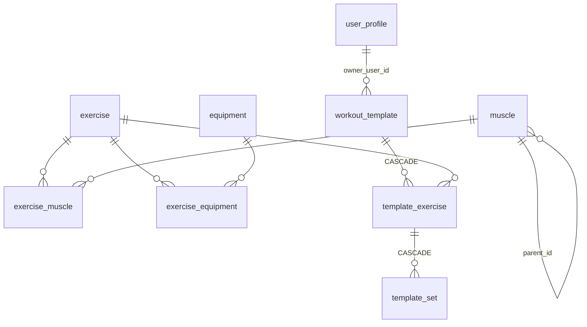

# Banco de Dados

Modelo local (Room/SQLite) e sua correspondência futura no PostgreSQL. Regras de negócio que
usam esses dados estão em [PRODUCT_SPEC.md](PRODUCT_SPEC.md); a sincronização em [SYNC.md](SYNC.md).

## 1. Convenções

| Convenção | Regra | Motivo |
|---|---|---|
| Chave primária | `id TEXT` com **UUID** gerado no cliente (v7, ordenado por tempo) | Registros nascem offline em qualquer dispositivo sem colisão; o mesmo id vale no servidor e no iOS. O v7 melhora a localidade dos índices (B-tree) no PostgreSQL. |
| Tempo | `*_at INTEGER` = epoch **milissegundos UTC** | Sem ambiguidade de fuso; cálculo de cronômetro por subtração. |
| Data local | `local_date TEXT` ISO `YYYY-MM-DD` + `time_zone TEXT` (IANA) quando a data "do usuário" importa | Um treino às 23h30 em São Paulo pertence àquele dia no calendário, não ao dia UTC. |
| Cargas | `*_weight_g INTEGER` em **gramas** | Inteiros são exatos (sem erro de ponto flutuante), comparáveis por igualdade (PR "reps com a carga X") e seguros em JSON. kg/lb é só exibição (1 lb = 453,59237 g). |
| Enums de comportamento | `TEXT` com código estável (ex.: `WEIGHT_REPS`) | Legível, estável entre versões e plataformas; ordem de declaração em Java não importa. |
| Conteúdo configurável | Tabelas de dados (músculos, equipamentos, técnicas, conquistas, métricas corporais) | Expansível sem nova versão do app. |
| Exclusão | Raízes de agregado usam **exclusão lógica** (`deleted_at`) | Tombstones são necessários para sincronizar exclusões; histórico nunca é apagado em cascata. |
| Dono | `owner_user_id` em todo dado do usuário; `NULL` = catálogo do sistema | O banco nunca pressupõe um único usuário. |
| Sincronização | Só em **raízes de agregado**: `sync_status`, `server_version` (+ `created_at`, `updated_at`, `deleted_at`) | Filhos viajam junto com a raiz (ver SYNC.md §3). |
| Nomes | `snake_case`, tabelas no singular | Igual no Room e no PostgreSQL. |

`sync_status`: `PENDING` (alteração local ainda não enviada) ou `SYNCED`. Linhas do catálogo do
sistema nascem `SYNCED` e nunca são enviadas.

## 2. Esquema implementado — versão 3 (Fases 0–3)

### `app_metadata`
| Coluna | Tipo | Notas |
|---|---|---|
| `meta_key` | TEXT PK | `catalog_version`, `current_user_id` |
| `meta_value` | TEXT NOT NULL | |

Fica dentro do banco (e não em SharedPreferences) para que catálogo e banco nunca fiquem
dessincronizados após backup/restauração. As consultas de dados do usuário filtram por
`owner_user_id = (SELECT meta_value FROM app_metadata WHERE meta_key = 'current_user_id')`: assim
as listas observadas reagem sozinhas a uma futura troca de conta, sem guardar o id em estado Java.

### `user_profile`
| Coluna | Tipo | Notas |
|---|---|---|
| `id` | TEXT PK | Identidade local criada na 1ª execução |
| `display_name` | TEXT NULL | |
| `is_local` | INTEGER NOT NULL | 1 = ainda sem conta no servidor |
| `remote_user_id` | TEXT NULL | Preenchido ao vincular conta (Fase 8/9) |
| `created_at`, `updated_at` | INTEGER NOT NULL | |

### `muscle` (catálogo, hierárquico)
| Coluna | Tipo | Notas |
|---|---|---|
| `id` | TEXT PK | UUID fixo do catálogo |
| `parent_id` | TEXT NULL FK → `muscle.id` | `NULL` = grupo; preenchido = subgrupo |
| `code` | TEXT NOT NULL UNIQUE | Ex.: `back`, `back.lats` |
| `name` | TEXT NOT NULL | pt-BR |
| `sort_order` | INTEGER NOT NULL | |

Hoje: 2 níveis (grupo → subgrupo), e o filtro por grupo usa `id = :g OR parent_id = :g`. O esquema
aceita mais níveis; se forem necessários, o filtro passa a usar CTE recursiva.

### `equipment` (catálogo)
`id` TEXT PK, `code` TEXT UNIQUE, `name` TEXT, `sort_order` INTEGER.

### `exercise`
| Coluna | Tipo | Notas |
|---|---|---|
| `id` | TEXT PK | |
| `owner_user_id` | TEXT NULL | `NULL` = sistema; preenchido = exercício personalizado (futuro) |
| `code` | TEXT NULL UNIQUE | Slug estável do catálogo (ex.: `barbell_bench_press`) |
| `name` | TEXT NOT NULL | |
| `aliases` | TEXT NULL | Outros nomes usados em academias ("puxador", "pulley") |
| `search_text` | TEXT NOT NULL | `normalize(name + aliases)` — minúsculas, sem acentos |
| `description`, `instructions`, `tips`, `common_mistakes`, `notes` | TEXT NULL | Instruções: um passo por linha |
| `tracking_type` | TEXT NOT NULL | `WEIGHT_REPS`, `BODYWEIGHT_REPS`, `REPS_ONLY`, `DURATION`, `WEIGHT_DURATION` |
| `load_basis` | TEXT NOT NULL | `TOTAL` (barra/máquina) ou `PER_IMPLEMENT` (cada halter) |
| `implement_count` | INTEGER NOT NULL | Implementos simultâneos (2 = dois halteres) |
| `laterality` | TEXT NOT NULL | `BILATERAL` ou `UNILATERAL` |
| `is_active` | INTEGER NOT NULL | Status ativo/inativo |
| `created_at`, `updated_at`, `deleted_at` | INTEGER | |
| `sync_status`, `server_version` | TEXT, INTEGER NULL | |

### `exercise_muscle`
PK (`exercise_id`, `muscle_id`); `role` TEXT (`PRIMARY`/`SECONDARY`); `sort_order` INTEGER (o
primeiro PRIMARY é o destaque). FK para `exercise` com CASCADE. Índice em `muscle_id`.

### `exercise_equipment`
PK (`exercise_id`, `equipment_id`); `is_primary` INTEGER. Índice em `equipment_id`.

### `workout_template` (raiz de agregado)
| Coluna | Tipo | Notas |
|---|---|---|
| `id` | TEXT PK | |
| `owner_user_id` | TEXT NOT NULL | |
| `name` | TEXT NOT NULL | |
| `description` | TEXT NULL | |
| `notes` | TEXT NULL | Observação **permanente** do treino |
| `sort_order` | INTEGER NOT NULL | Ordem na lista "Meus treinos" |
| `archived_at` | INTEGER NULL | Arquivado ≠ excluído |
| `origin` | TEXT NOT NULL | `CREATED`, `DUPLICATED`, `IMPORTED` |
| `origin_template_id` | TEXT NULL | De onde veio a cópia (sem FK: pode ser de outro usuário) |
| `created_at`, `updated_at`, `deleted_at` | INTEGER | |
| `sync_status`, `server_version` | | |

### `template_exercise` (filho)
`id` TEXT PK · `template_id` FK CASCADE · `exercise_id` FK · `position` INTEGER · `rest_seconds`
INTEGER NOT NULL (0 = sem descanso automático) · `notes` TEXT NULL (observação permanente deste
exercício neste treino) · `side_mode` TEXT (`COMBINED`/`PER_SIDE`).

### `template_set` (filho) — "SetPlan"
`id` TEXT PK · `template_exercise_id` FK CASCADE · `position` INTEGER · `target_reps_min` /
`target_reps_max` INTEGER NULL (faixa 8–10; valor fixo quando iguais) · `target_weight_g` INTEGER
NULL · `target_duration_s` INTEGER NULL · `rest_seconds` INTEGER NULL (sobrescreve o do exercício) ·
`technique_id` TEXT NULL FK → `training_technique.id` (NULL = série normal de trabalho).

### `training_technique` (catálogo, v2)
| Coluna | Tipo | Notas |
|---|---|---|
| `id` | TEXT PK | UUID fixo do catálogo |
| `owner_user_id` | TEXT NULL | `NULL` = sistema; preenchido = técnica do usuário (futuro) |
| `code` | TEXT NOT NULL UNIQUE | Badge curto: `AQ`, `D`, `RP`, `MR`, `CL`, `F`, `PIR`, `PIV`, `SS`, `BI`, `TRI`, `GS` |
| `name` | TEXT NOT NULL | |
| `scope` | TEXT NOT NULL | `SET` (série), `EXERCISE` (sequência de séries), `GROUP` (liga exercícios) |
| `counts_as_working_set` | INTEGER NOT NULL | 0 no aquecimento: fica fora de volume e recordes |
| `description`, `instructions` | TEXT NULL | Conteúdo do ⓘ na interface |
| `params_schema` | TEXT NULL | JSON com parâmetros (quedas, mini-séries) — ainda não usado |
| `sort_order`, `is_active`, `created_at`, `updated_at` | | |

O índice único é só em `code` enquanto existirem apenas linhas do sistema. Antes de permitir técnicas
criadas pelo usuário, trocar por um índice em (`owner_user_id`, `code`) — lembrando que, no SQLite,
vários `NULL` são considerados distintos em índices únicos.

### `user_setting` (v2)
PK (`owner_user_id`, `setting_key`) · `value` TEXT · `updated_at` · `sync_status`. Chaves atuais:
`rest_default_seconds`, `rest_sound_enabled`, `rest_vibration_enabled`. Preferências **da conta**
ficam aqui (seguem o usuário para outro aparelho); as **do aparelho** (tema, tamanho da interface)
ficam em SharedPreferences.

**Por que filhos não têm `deleted_at`/`sync_status`:** o agregado "treino" é salvo e sincronizado
como uma unidade. Ao salvar, os filhos são substituídos em uma transação, **preservando seus UUIDs**
(o rascunho carrega os ids), então referências externas continuam válidas.

### `workout_session` (raiz de agregado, v3)
| Coluna | Tipo | Notas |
|---|---|---|
| `id` | TEXT PK | |
| `owner_user_id` | TEXT NOT NULL | |
| `template_id` | TEXT NULL | **Sem FK**: o template pode ser excluído sem tocar o histórico |
| `name` | TEXT NOT NULL | Snapshot do nome do treino no início |
| `notes` | TEXT NULL | Observação **desta sessão** |
| `status` | TEXT NOT NULL | `ACTIVE`, `COMPLETED`, `DISCARDED` |
| `started_at` | INTEGER NOT NULL | |
| `ended_at` | INTEGER NULL | |
| `time_zone` | TEXT NOT NULL | Fuso em que o treino foi feito |
| `local_date` | TEXT NOT NULL | Data ISO naquele fuso: é por ela que o calendário agrupa |
| `total_paused_ms` | INTEGER NOT NULL | **Cache**: recalculado das pausas ao finalizar; nenhuma leitura o trata como verdade |
| `rating` | INTEGER NULL | Avaliação 1–5 (sem interface ainda) |
| `rest_set_log_id` | TEXT NULL | Série cujo descanso está correndo (sem FK: estado transitório) |
| `rest_ends_at` | INTEGER NULL | **Instante** em que o descanso termina |
| `rest_remaining_ms_when_paused` | INTEGER NULL | Descanso congelado enquanto a sessão está pausada |
| `created_at`, `updated_at`, `deleted_at` | INTEGER | |
| `sync_status`, `server_version` | | |

Índices: `owner_user_id` e (`owner_user_id`, `local_date`).

**Uma sessão ativa por usuário** é garantida por `countActive()` + inserção **na mesma transação**, na
thread única de disco — não por índice: o Room não declara índice único parcial, e criar um por fora
faz a validação de esquema falhar ao abrir o banco (ADR-0032).

### `session_pause` (v3)
`id` TEXT PK · `session_id` FK CASCADE · `started_at` INTEGER NOT NULL · `ended_at` INTEGER NULL
(`NULL` = pausa aberta, ou seja, a sessão está pausada agora).

### `session_exercise` (v3)
`id` TEXT PK · `session_id` FK CASCADE · `exercise_id` FK (o catálogo só é desativado, nunca apagado)
· `template_exercise_id` TEXT NULL · `position` · **snapshots**: `exercise_name`, `tracking_type`,
`load_basis`, `implement_count`, `laterality`, `side_mode`, `rest_seconds`, `permanent_notes` ·
`notes` (da sessão) · `previous_session_exercise_id` (ponteiro congelado para a comparação, sem FK) ·
`started_at` NULL.

Músculos **não** são copiados: estatísticas por grupamento leem o catálogo atual, então uma correção
anatômica também corrige o passado (§4).

### `set_log` (v3)
`id` TEXT PK · `session_exercise_id` FK CASCADE · `parent_set_id` TEXT NULL (auto-FK: segmentos de
drop-set/rest-pause, ainda sem interface) · `position` · `technique_id` FK →
`training_technique.id` · **planejado**: `planned_reps_min`, `planned_reps_max`, `planned_weight_g`,
`planned_duration_s`, `planned_rest_seconds` (NOT NULL) · **realizado**: `weight_g`, `reps`,
`reps_left`, `reps_right`, `duration_s` · `status` (`PENDING`/`COMPLETED`/`SKIPPED`) · `completed_at`
· `notes`.

Um campo de realizado em `NULL` significa **"ainda não confirmado"**. Sugestões nunca são gravadas
aqui: elas são derivadas da sessão anterior (PRODUCT_SPEC §6.5). O pareamento com a sessão anterior é
por **ordinal entre as séries de trabalho**, calculado em Java (`WorkingSetPairing`), porque o SQLite
da API 28 não tem funções de janela — e porque dado derivado se corrige com um release, enquanto uma
coluna exigiria migration (ADR-0033).

### Leituras do histórico (Fase 4) — **sem mudança de esquema**

A Fase 4 não criou nem alterou nenhuma tabela: o banco continua na **versão 3**. Tudo o que o
histórico mostra já estava gravado desde a v3 — inclusive `local_date`, `time_zone` e `rating`, que
existiam sem ninguém ler. O que entrou foram consultas novas em `SessionDao`:

| Consulta | O que responde |
|---|---|
| `observeCompletedSessions()` / `findCompletedSessions()` | a lista, uma linha por sessão, com as pausas já somadas e os exercícios e séries feitas já contados em SQL |
| `findPreviousSessionOfTemplate(templateId, startedAt)` | a sessão anterior **do mesmo template**, para a comparação do §11 |

Três detalhes que não são opcionais:

- **`status = 'COMPLETED'` é explícito.** Uma sessão descartada também tem `ended_at`: "terminou" não
  é "aconteceu". Filtrar por `ended_at IS NOT NULL` traria o lixo de volta.
- **`parent_set_id IS NULL` na contagem de séries.** Hoje não existe nenhuma linha filha, mas os
  segmentos de drop-set/rest-pause vão ser exatamente isso — sem o filtro, o dia em que aquela tela
  entrar todas as sessões passadas passam a contar séries a mais, silenciosamente.
- **As pausas são somadas de `session_pause`, não lidas de `total_paused_ms`**, que é só cache (§2).

O **volume** continua fora do SQL, e de propósito: as regras do PRODUCT_SPEC §9 (carga por implemento
multiplicada, reps por lado somadas, peso corporal e séries por tempo fora) vivem em `SessionVolume`,
no `:domain`. Reimplementá-las em SQL daria à lista e à tela da sessão duas chances de discordar — e
a "N séries não incluídas no volume" tem de significar a mesma coisa nos dois lugares.

**Índices:** nenhum foi criado. `workout_session` tem índice em `owner_user_id`, e a ordenação por
`started_at` e a busca por `template_id` são varredura em cima disso. No volume de dados de uma pessoa
(centenas de sessões) isso não se mede; quando medir, um índice é uma migration v5 com teste, não um
ajuste solto.

## 3. Tabelas planejadas (próximas migrations)

### Fase 1 — mídia
`exercise_media`: `id`, `exercise_id`, `kind` (`IMAGE_START`, `IMAGE_END`, `THUMBNAIL`,
`ANIMATION`, `VIDEO`), `source_uri`, `local_path`, `mime_type`, `width`, `height`, `size_bytes`,
`duration_ms`, `license`, `attribution`, `sort_order`.

### Fase 2 — grupos de exercícios (o que falta)
- `template_exercise_group`: `id`, `template_id`, `label` (A, B…), `technique_id`, `rest_after_round_s`.
- Novas colunas: `template_exercise.group_id`, `.technique_id` (esquema de séries, ex.: pirâmide),
  `.technique_params`; `template_set.technique_params`.

### Fase 3 — o que ficou de fora da v3 (migrations futuras)
As sessões **já existem** (ver §2). Continuam planejados, e **não foram criados** na v3:
- `session_exercise_group` e `session_exercise.group_id` — entram com os grupos (supersérie), junto
  com `template_exercise_group`.
- `workout_session.routine_id` e `.routine_date` — entram com as rotinas (Fase 6).
- Segmentos de drop-set/rest-pause: a coluna `set_log.parent_set_id` **existe**, e todas as consultas
  filtram `parent_set_id IS NULL`; falta a interface para registrar as etapas.

### Fase 5 — recordes e peso corporal
- `personal_record`: `id`, `owner_user_id`, `exercise_id`, `record_type` (`MAX_WEIGHT`,
  `MAX_REPS_AT_WEIGHT`, `MAX_SET_VOLUME`, `MAX_SESSION_VOLUME`, `EST_1RM`), `value` INTEGER,
  `weight_g`, `reps`, `session_id`, `set_log_id`, `achieved_at`, `is_baseline`. Um registro por novo
  PR (histórico preservado). Dado **derivado**: pode ser recalculado a partir das sessões.
- `body_metric_definition` (catálogo): `id`, `code`, `name`, `unit`, `sort_order`.
- `body_measurement` (raiz): `id`, `owner_user_id`, `measured_at`, `local_date`, `source`,
  `device_name`, `notes`, colunas de sync.
- `body_metric_value`: `id`, `measurement_id`, `metric_id`, `value` REAL. Modelo chave-valor
  proposital: cada balança de bioimpedância fornece métricas diferentes e valores ausentes são normais.

### Fase 6 — rotinas e metas
- `routine` (raiz): `id`, `owner_user_id`, `name`, `kind` (`WEEKLY`/`CYCLE`), `anchor_date`,
  `is_active`, `reminder_enabled`, `reminder_time`, `reminder_lead_minutes`, sync.
- `routine_slot`: `id`, `routine_id`, `day_index` (0–6 semanal; 0–N−1 ciclo), `template_id` NULL
  (NULL = descanso), `label`.
- `routine_adjustment` (append-only): `id`, `routine_id`, `kind` (`SHIFT`, `SKIP`, `SUBSTITUTE`),
  `effective_date`, `days`, `template_id`, `session_id`, `created_at`. A posição no ciclo é
  **calculada** a partir de âncora + ajustes + sessões, nunca armazenada como contador mutável.
- `goal` (raiz): `id`, `owner_user_id`, `kind` (`SESSIONS_PER_WEEK`…), `target`, `starts_on`,
  `ends_on`, `is_active`, sync.

### Fase 7 — conquistas
- `achievement_definition`: `id`, `owner_user_id` NULL, `code`, `category`, `name`, `description`,
  `icon_key`, `rule_type`, `rule_params` (JSON, ex.: `{"exerciseId": "...", "metric": "MAX_WEIGHT"}`),
  `sort_order`, `is_active`.
- `achievement_tier`: `id`, `definition_id`, `level` (1–4), `name` (Bronze…Platina), `threshold`.
- `user_achievement`: `id`, `owner_user_id`, `definition_id`, `tier_id`, `unlocked_at`,
  `session_id`. Único por (`owner_user_id`, `tier_id`). Progresso é **calculado**, não armazenado.

### Configurações e sync
- `user_setting`: **já implementada** (ver §2). Faltam as chaves de unidade (kg/lb) e de
  pré-preenchimento, que entram com as funções que as usam.
- `sync_state` (Fase 9): cursor de pull por escopo.

### Somente no servidor (Fase 8+)
`app_user`, `user_credential`, `refresh_token` (hash), `email_verification_token` (hash),
`password_reset_token` (hash), `share_link` (token, código curto, snapshot do template, expiração,
revogação), `change_log` (sequência monotônica por usuário para o pull).

## 4. Snapshots e histórico

- Sessões copiam do template e do exercício tudo o que é necessário para **reexibir e recalcular**
  a sessão (nome, semântica de carga, planejado por série). Mudar o template ou renomear um
  exercício não altera o passado.
- Excluir um template é **lógico** e não toca sessões (`workout_session.template_id` não tem FK).
- Músculos de um exercício **não** são copiados: estatísticas por grupamento usam o catálogo atual
  (a identidade do exercício é estável; correções anatômicas devem valer para o histórico).

## 5. Migrations

- `exportSchema = true`; os JSONs de esquema ficam versionados em `android-app/app/schemas/`.
- Toda mudança de esquema = nova versão + `Migration` explícita + teste de migration.
- **v1 → v2** (`AppDatabase.MIGRATION_1_2`): cria `training_technique` e `user_setting`, e adiciona
  `template_set.technique_id` (com FK e índice). O `MigrationTest` monta um banco v1 a partir do
  schema exportado, insere um treino e abre com o Room: se a migration divergir do esquema esperado,
  o teste falha (verificado quebrando o índice de propósito).
- **v2 → v3** (`AppDatabase.MIGRATION_2_3`): cria as quatro tabelas de sessão. **Só cria tabelas** —
  nada existente é tocado, então uma atualização interrompida não pode danificar os treinos que o
  usuário já tem. O `MigrationTest` vai de v1 a v3 e também prova o cascade: excluir uma sessão
  remove pausas, exercícios e séries.
- **Nunca** `fallbackToDestructiveMigration` em builds de release: o usuário usa o app de verdade.

## 6. Correspondência com PostgreSQL (Fase 8)

| SQLite (Room) | PostgreSQL |
|---|---|
| `TEXT` UUID | `uuid` |
| `INTEGER` epoch ms | `timestamptz` (conversão na API: ISO-8601 UTC) |
| `INTEGER` gramas | `integer` |
| `INTEGER` 0/1 | `boolean` |
| `TEXT` enum | `text` + `CHECK` (ou tabela de referência) |
| `TEXT` JSON | `jsonb` |
| `server_version` | `bigint` incrementado a cada alteração aceita |
